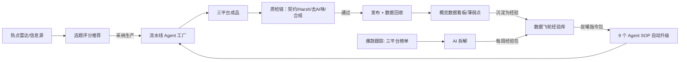

# 自媒体运营工厂 · 从选题到发布的全自动内容工厂

> **一句话介绍**：把 选题 → 生产 → 质检 → 发布 → 数据复盘 → 经验反哺 这条自媒体运营闭环，做成一个可视化工作台加 AI Agent 流水线。个人博主和小团队用它持续产出高质量内容，而且系统越用越懂你的账号。

  

**本仓库 = 免费版完整工作台**：clone 下来一键启动，浏览器打开 http://127.0.0.1:8787 即可使用（选题、爆款榜单、质检、成品库）。免费版与付费版功能有区别，付费解锁全部功能，见第五节对比表与第八节购买方式。

---

## 一、项目总体介绍

### 1.1 它解决什么问题

做自媒体的人每天面对五个断点：

1. 选题没有方向。今天追什么热点？追了又怎么写才有人看？
2. 生产全靠硬写。素材、初稿、配图、排版全手工，一篇三小时起步。
3. 质量只能靠感觉。写完不知道有没有 AI 味，也不知道会不会踩平台红线。
4. 数据发完就忘。没人回填，搞不清哪篇为什么火。
5. 经验留不下来。这次踩的坑，下次照样踩。

自媒体运营工厂把五个断点连成一条流水线，并把经验沉淀成可执行规则，让系统自己进化。

### 1.2 它是什么

- **一个本地工作台**（Web UI，仅绑定 127.0.0.1）：概览、选题、爆款跟踪、数据飞轮、流水线、成品库、数据管理、设置八大模块，内置 8 套高审美主题（LV 奢华、香奈儿蔚蓝、爱马仕橙、日系奶油等）与毛玻璃无级调节；
- **一套 Agent 流水线**：总编、采编、小红书主编、公众号主编、短视频导演、美术总监、资深校对、合规审核、归档发布 9 个角色分工协作；
- **一套机器可算的质检体系**：素材契约校验 + Harsh Critic 双轨评分 + 去 AI 味 22 条规则 + 三平台合规审核；
- **一套可商用的授权体系**：Ed25519 签名 token + 设备指纹绑定，免费/Pro 分级。

### 1.3 适用人群

| 人群 | 典型用法 |
|---|---|
| 个人博主（小红书/公众号/短视频） | 每天 30 分钟：看选题 → 采纳 → 自动生产 → 人工复核发布 |
| 小团队/代运营 | 用统一 SOP 与预设文风保证多人交付质量一致 |
| 自媒体创作者/学员 | 拿到就能跑的运营工厂，开箱即用体验完整闭环 |

---

## 二、核心模块介绍与按钮功能

### 2.1 概览（数据分析 + 薄弱点诊断 + 首启向导）

小红书式四页签分析（观看 / 互动 / 涨粉 / 发布），支持 **近7日 / 近30日** 切换，每页含 KPI、趋势折线、来源/时段/体裁分解、笔记明细聚合。下方的薄弱点诊断会按规则引擎自动指出问题，并给出提升方向。新用户首次启动时提供「3 分钟跑通」4 步向导（侧边栏 🚀 随时重开）。

| 按钮/交互 | 功能 |
|---|---|
| 观看 / 互动 / 涨粉 / 发布 | 切换四类分析页签 |
| 近7日 / 近30日 | 切换统计窗口 |
| 沉淀为经验 | 把某条薄弱点诊断一键写入数据飞轮经验库 |
| 刷新统计 | 重新扫描 jobs/ + outputs/ 生成最新统计 |
| 导入小红书明细表 | 上传小红书导出 xlsx，明细进入大盘统计 |
| 导入看板导出表 | 上传观看/互动/涨粉/发布四类导出 xlsx（自动识别页签类型） |
| 保存回填 | 手动回填某任务在指定平台的阅读/赞/藏/评/链接 |

### 2.2 选题（热点雷达 + 双池评分 + 平台赛道偏好）

多信息源热点雷达（今日热榜、知乎/微博/36氪公网 RSS、hex2077 AI 日报、推楼 1 号等）→ 评分模型分 **日选题**（重时效热度）和 **周选题**（重内容质量）两个池子，每个推荐带评分明细表。支持左侧多平台、右侧细分赛道偏好勾选与保存。

| 按钮/交互 | 功能 |
|---|---|
| 采集热点 + 推荐 | 拉取信息源 → 生成热点雷达 → 跑评分 → 刷新推荐表 |
| 采纳生产 | 把该选题创建为生产任务（真实入队流水线），一键开始全自动生产 |
| 偏好设置（平台/赛道） | 勾选关注的平台与细分赛道，保存后精准过滤推荐 |
| 信息源启用开关 | 每类信息源独立开关 + 显示最近采集时间与成功/失败状态 |
| 进行中 / 最近采纳 | 已采纳任务实时状态，点击跳转流水线 |

### 2.3 爆款跟踪（三平台每日榜单 + AI 拆解）

每日自动采集小红书 / 抖音 / 微信公众号三个平台 Top10（标题 + 热度 + 链接），热度前 5 自动 AI 拆解，输出前 3 秒钩子、选题角度、结构、情绪人群、金句留存、剪辑节奏、转化设计、公式标签等结构化字段；每周聚合为平台经验包反哺数据飞轮。

| 按钮/交互 | 功能 |
|---|---|
| KPI 卡片 | 跟踪总数 / 拆解中 / 已拆解 / 已应用，一眼看全库状态 |
| 采集今日榜单 | 立即重拉三平台当日榜单（含各源成功/失败状态与时间） |
| 自动拆解 Top5 | 每平台热度前 5 自动走 AI 拆解（Pro 无限，免费 3 次/月） |
| 开始拆解 / 已拆解·重新拆 | 单条手动拆解或重拆 |
| 查看报告 | 弹窗阅读该条拆解报告（Markdown 渲染） |
| 转入跟踪并拆解 | 自家爆款复盘：把已发布高表现内容转入跟踪库并直接拆解 |
| ＋添加爆款 | 手工录入外部爆款（标题/链接/正文/逐字稿） |
| 生成本周经验包 | 聚合近 7 天拆解 → 写经验库 + 自动升级对应 Agent SOP |

### 2.4 数据飞轮（越用越强的引擎）

把 账户数据反馈、市场数据快照、已沉淀经验、爆款公式 汇总成反哺指令包，自动映射并写入 9 个 Agent 的 SOP 文档（版本递增 + changelog），下次生产即时生效。

| 按钮/交互 | 功能 |
|---|---|
| 重新生成反哺指令包 | 汇总四类输入 → 生成 pipeline_feedback.md → 自动升级全部 Agent SOP |
| 生成本周经验包 | 手动触发周度爆款经验聚合（平时周一自动） |
| 保存经验 / 编辑 / 删除 | 经验库 CRUD（每条经验含结论/证据/apply_to 映射） |
| 应用到 Agent | 查看/预览经验将如何写入对应 Agent 文档 |
| 展开历史经验 | 查看更早的经验条目 |

### 2.5 流水线（生产状态机 + 实时进度）

采纳选题后任务真实入队（`data/production/queue.json`），串行执行：素材 → 初稿 → 视觉 → 质检 → 归档，每阶段调用本机 Codex CLI 推进状态；页面 3 秒轮询 + 手动刷新实时跟踪。

| 按钮/交互 | 功能 |
|---|---|
| 刷新 | 手动刷新队列、当前任务、状态机进度、日志与产物 |
| 取消 | 终止当前运行中的生产任务（SIGTERM） |
| 重新生产 | 把已完成/失败任务重新入队再跑一遍 |
| 查看成品/进度 | 跳转成品库查看该任务产出 |
| 查看 SOP 文档 | 弹窗阅读任意 Agent 的版本化 SOP（Markdown 阅读模式） |

### 2.6 成品库（三平台产物 + 质检报告）

小红书卡片轮播 / 公众号排版预览（桌面+移动）/ 短视频分镜脚本，右侧同屏显示任务状态、质检报告（契约 / Harsh Critic / 去 AI 味 / 合规）、发布记录。

| 按钮/交互 | 功能 |
|---|---|
| 小红书 / 公众号 / 短视频 | 切换产物类型 |
| 已发布 / 未发布 / 全部 + 月份筛选 | 按发布状态与月份过滤任务 |
| 复制标题 / 复制正文 | 一键复制小红书标题（≤20 字）与正文（≤1000 字） |
| 标记已手动发布 | 人工发布后记录动作，保住 48h 数据回收闭环 |
| 查看规则 | 弹窗查看去 AI 味 22 条规则全文 |

### 2.7 数据（自有数据统计）

平台对比（发布动作/回填/阅读/互动率/爆款数）、主题表现、内容特征分析（标题含数字 vs 不含、体裁、公众号图表数、小红书卡片数 vs 表现）、最佳表现 TOP、发布表现明细与数据来源口径（发布动作自动记录 + 人工回填，不依赖第三方接口）。

### 2.8 设置（外观皮肤 + 文风预设 + 数据生命周期 + 凭据）

| 按钮/交互 | 功能 |
|---|---|
| 外观皮肤与质感 | 8 套高审美主题（LV 奢华、香奈儿蔚蓝、爱马仕橙等）+ 4 档质感 + 毛玻璃无级调节 |
| 文风预设与向导 | 5 套开箱即用预设模板（科技实战/深度商业/小红书轻快/职场认知/通用填空）+ AI 生成 |
| 数据管理（呈现/清理）| 存储占用可视化、一键安全释放过期日志与未成爆款图片 |
| LLM / 公众号凭据 | 本地 .env 密钥保存（掩码存储、一键测试连接）与 Pro 授权 token 激活 |

---

## 三、模块怎么联动（数据流）



闭环一句话：**热点进 → 推荐出 → 采纳即生产 → 质检才归档 → 数据回来 → 经验升级 Agent → 下一次写得更好**。

---

## 四、对比市面其他产品

| 方案 | 选题 | 生产 | 质检 | 数据反哺 | 商业模式 |
|---|---|---|---|---|---|
| **本产品（运营工厂）** | ✅ 多源雷达+双池评分 | ✅ 9 Agent 流水线自动生产 | ✅ 4 道机器质检 | ✅ 数据飞轮自动升级 SOP | 开源核心 + 付费订阅 |
| 普通 AI 写作工具/提示词模板 | ❌ 无选题 | ✅ 单次生成 | ❌ 无 | ❌ 无 | 一次性买断/订阅 |
| 内容中台/数据平台（新榜、蝉小红等） | ✅ 热榜 | ❌ 不生产 | ❌ 无 | ⚠️ 只有报表 | 按年付费，面向机构 |
| Claude Skill 市场（Loreto/AgentPowers） | ❌ 只做分发 | ⚠️ 单 skill | ❌ 无 | ❌ 无 | 平台抽成 |
| 自建 n8n/RSS 工作流 | ✅ 采集 | ⚠️ 需自己写 | ❌ 无 | ❌ 无 | 时间成本极高 |

**核心差异**：
- 竞品只负责生成，我们负责从生产到复盘的整个闭环：质检、发布、数据回收、经验进化都包含在内。
- 质检可以计算：契约引用率、评分公式、22 条去 AI 味规则、合规词库，不靠感觉拍脑袋。
- 数据飞轮让系统越用越懂你的账号，这是模板和插件给不了的。

---

## 五、免费版 vs 付费版（Pro）

| 功能 | 免费版 | Pro（¥29/月，¥199/年） |
|---|---|---|
| 选题雷达（基础信息源） | ✅ | ✅ 全源 + 评分双池 |
| 基础排版模板与文风 | ✅ 通用填空向导 | ✅ 5 大赛道预设文风模板（科技/商业/小红书/职场等） |
| 外观皮肤与质感系统 | 仅第一款皮肤（蓝白默认） | ✅ 8 套高级主题 + 4 档质感 + 毛玻璃无级调节 |
| 爆款 AI 拆解 | 3 次/月 | ✅ 无限 + 每日 Top5 自动拆解 |
| 一键全自动生产（素材→初稿→视觉→质检→归档） | ❌ | ✅ |
| 数据飞轮（经验自动升级 Agent SOP） | ❌ | ✅ |
| 合规审核 + 去 AI 味全套 | 仅基础合规提示 | ✅ 完整套件 |
| 公众号草稿推送 / 发布数据回收 | ❌ | ✅ |
| 优先更新 / 客服 | ❌ | ✅ |

**授权机制**：Ed25519 签名 token 绑定单台设备，到期续费；换设备免费重绑一次。开源核心（质检 + 授权模块）永远 MIT 免费。

---

## 六、从零开始使用（约 5 分钟，小白版）

### 第一步：确认电脑环境（只做一次）

需要一台 macOS 或 Linux 电脑，装有 Python 3.11 以上。在终端里运行：

```bash
python3 --version
```

能打印出版本号就说明没问题。

### 第二步：下载本仓库

```bash
git clone https://github.com/hjdiandian1-ops/selfmedia-ops-center.git
cd selfmedia-ops-center
```

### 第三步：一键安装（只做一次）

```bash
python3 scripts/workbench_install.py
```

安装器会自动创建虚拟环境、安装依赖、生成 `.env` 配置文件。全程不需要你手动敲任何别的命令。

### 第四步：启动工作台

```bash
./start.sh
```

浏览器会自动打开 http://127.0.0.1:8787 ，这就是你的工作台：左侧七个模块（概览/选题/爆款跟踪/数据飞轮/流水线/成品库/数据）全部可用。

### 第五步：解锁 AI 能力（可选，2 分钟）

免费版不用配任何东西就能用：选题雷达、三平台爆款榜单、质检、成品库。想用 AI 拆解和一键生产时，编辑仓库根目录的 `.env`：

```text
LLM_API_KEY=sk-你的key
LLM_BASE_URL=https://api.deepseek.com/v1
LLM_MODEL=deepseek-chat
```

支持任何 OpenAI 兼容接口（DeepSeek / OpenAI / Moonshot / 本地 Ollama 等），填完重启 `./start.sh` 即可。机器上装了 Codex CLI 时优先用 Codex，没装就用 API Key，两种都不需要你对接平台。

### 第六步：了解免费/付费怎么切

免费版直接使用；点击生产、数据飞轮、自动拆解等 Pro 功能时，页面会提示升级，左侧底部也常驻显示你的授权状态（免费版/Pro 已激活）。

### 在 WorkBuddy 中部署

把本仓库作为工作区加载到 WorkBuddy（或任何 Codex/Claude 兼容环境），同样先运行 `workbench_install.py` 并在 `.env` 填好 `LLM_API_KEY`。之后可以在 WorkBuddy 对话里直接指挥本仓库的脚本：

```text
运行 python3 scripts/run_daily_pipeline.py --topics
```

WorkBuddy 负责对话与调度，工作台与数据仍在本仓库内，两者共用同一套产物和质检链。

## 七、安全与隐私

- 本仓库**不包含**任何真实账号数据、发布内容、NAS 配置或第三方 skill；
- 报告/日志中的路径一律相对化；发布前必须通过 [SECURITY_CHECKLIST.md](SECURITY_CHECKLIST.md) 全部检查；
- CI 六道闸门：gitleaks / pip-audit / bandit / semgrep / CodeQL / pytest；
- 漏洞报告请走 [SECURITY.md](SECURITY.md) 的流程。
- 使用约定：开源核心遵循 MIT；请勿使用本项目代码或文档训练/蒸馏 AI 模型，或直接打包转售。Pro 授权协议另行明确禁止对授权内容做 AI 训练/蒸馏。

## 八、购买与激活（付费版）

### 9.1 价格

| 档位 | 价格 | 说明 |
|---|---|---|
| 免费版 | ¥0 | 注册即可用基础功能（选题/排版/每月 3 次拆解） |
| Pro 月付 | ¥29/月 | 全功能，随时取消 |
| Pro 年付 | ¥199/年 | 约 7 折，推荐 |
| 企业版 | ¥999/年/席位 | 商用许可 + 部署支持（联系作者） |

### 9.2 购买流程（5 步）

1. 在面包多拍下 Pro 月付或年付商品（链接见 9.5）；
2. 付款后，在终端获取你的设备码：
   ```bash
   python3 scripts/license/install.py --show-fingerprint
   ```
   会输出一串类似 `mac_xxxx...` 的设备码；
3. 把设备码发给客服（微信/订单留言，见 9.5）；
4. 客服在 24 小时内（通常 1 小时）发回绑定 token；
5. 激活：
   ```bash
   python3 scripts/license/install.py --bind-token <客服发来的token>
   ```
   看到「授权激活成功」即可使用全部 Pro 功能；工作台左下角会立即显示「Pro 已激活 · 到期日期」（也可点 ⚙ 设置 →「刷新授权状态」手动刷新）。

> 到期后 Pro 功能自动拦截；续费后客服发新 token，重新激活即恢复会员。公众号自动推草稿需已认证公众号并在微信公众平台配置 AppID/Secret 与电脑公网 IP 白名单（详见「发布指引」，平台无法代办）。

### 9.3 换设备 / 续费

- 换设备：在新设备上运行 `install.py --show-fingerprint`，把新设备码发给客服免费重绑一次；之后每次收取 ¥10 服务费。
- 续费：到期前联系客服续费并领取新 token；到期后未续费时，Pro 功能会被授权门禁自动拦截。

### 9.4 售后服务

- 购买后一年内免费更新；
- 遇到安装问题，把终端输出截图发给客服，通常当天解决；
- 虚拟授权服务不支持无理由退款；因质量问题无法激活的，全额退款。

### 9.5 商品入口与联系方式（上线前必填）

> 免费版不需要付款，直接下载开源核心即可；付费只针对 Pro 工作台功能。
> 下面 4 项请作者在发布前替换为真实信息（商品文案参考 `docs/商品页文案.md`）。

- 面包多商品链接：`<TODO: 在 https://mbd.pub/ 创建商品后粘贴商品地址>`
- 客服微信二维码：`<TODO: 粘贴二维码图片>`（可直接在 README 同目录放 `docs/qr.png` 后引用）
- 公众号 / 邮箱：`<TODO>`
- 企业版咨询：`<TODO>`
