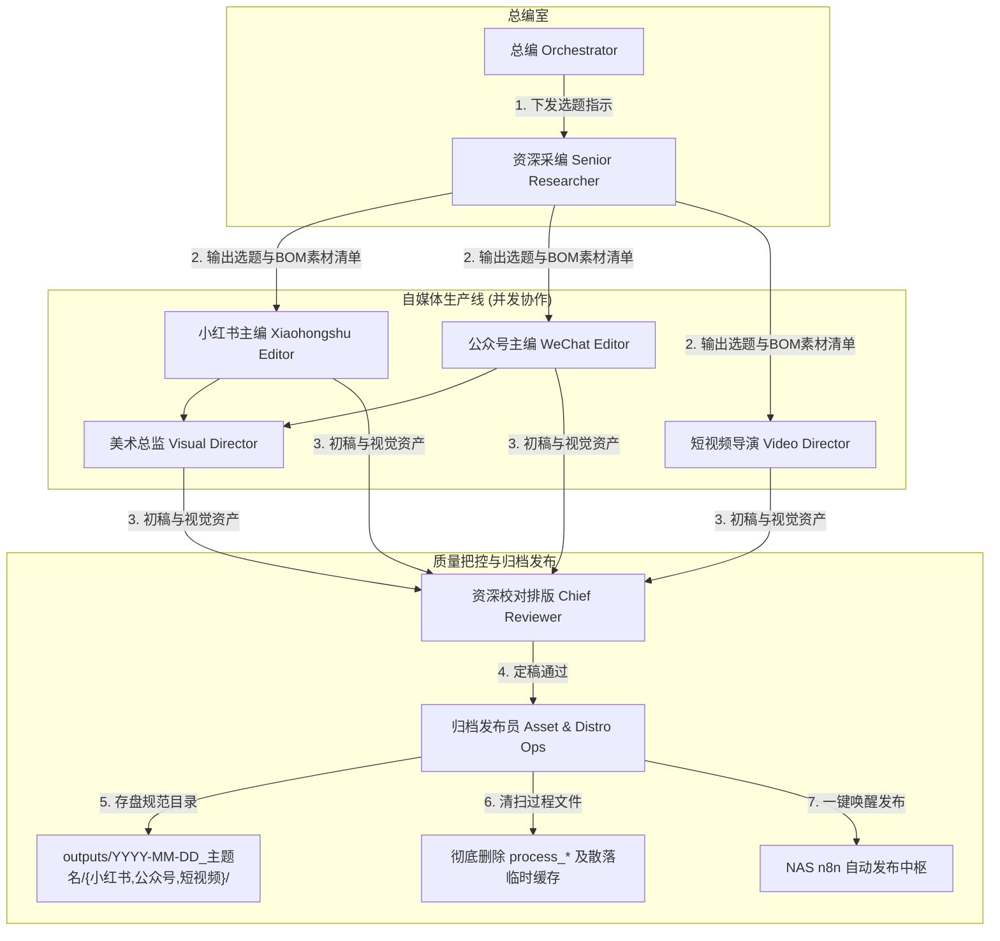

# 🚀 自媒体发布 Agent 项目使用说明书 (自媒体运营工厂)

> 本项目是一个高效、美观、可落地的 **自媒体内容生成与自动化发布 Agent 系统**，专注于 **小红书 + 微信公众号** 双平台运营。  
> 核心方法论来源于品牌内容营销操盘手 **@bbkirstry（小晚不在）**：**以个人 IP 为核、审美优先、通俗翻译、AI 放大人的判断力**。

---

## 目录 (Table of Contents)
1. [项目定位与核心原则](#1-项目定位与核心原则)
2. [系统总体架构与报社岗位分工](#2-系统总体架构与报社岗位分工)
3. [核心 Skill 技能库与双轨视觉系统](#3-核心-skill-技能库与双轨视觉系统)
4. [环境准备与 NAS 部署指南](#4-环境准备与-nas-部署指南)
5. [标准工作流程 (SOP) 与操作命令](#5-标准工作流程-sop-与操作命令)
6. [运维脚本与命令行速查](#6-运维脚本与命令行速查)
7. [项目目录结构与路线图](#7-项目目录结构与路线图)

---

## 1. 项目定位与核心原则

### 1.1 IP 人设定位
- **IP 账号**：小吴聊（AI / 科技实战操盘手）
- **核心调性**：直爽、实战、极客感、商业敏锐、用通俗语言拆解复杂 AI 技术。
- **三不原则**：
  1. 不说虚头八脑的套话与泛泛空谈
  2. 不输出未经实战验证的理论
  3. 不做低质视觉排版与丑陋对齐

### 1.2 平台差异化策略
- **📕 小红书**：
  - **定位**：生活化、强视觉、痛点驱动、爆款卡片。
  - **视觉**：采用 3:4 比例的高审美 HTML 结构化卡片或 FLUX/DALL-E 3 艺术插画封面。
- **📰 微信公众号**：
  - **定位**：深度长文、高排版审美、体系化思考。
  - **视觉/排版**：结合 `gzh-design-skill` 与 `xiaowan-wechat-layout-skill` 生成具备深色模式、无孤行、首屏震撼的精致 HTML。

---

## 2. 系统总体架构与报社岗位分工 (Teamwork)

系统采用 **“大脑思考/视觉设计（Local Agent Teamwork） + 自动化分发/基础设施（NAS n8n Engine）”** 的双层解耦架构：



### Agent 报社岗位职责分工
| 岗位名称 | 英文 Role | 主要职责 |
| :--- | :--- | :--- |
| **总编** | Orchestrator | 总体流程调度、指令解析、下发选题要求、控制人机确认节点、指挥发布。 |
| **资深采编** | Senior Researcher & Planner | 搜集热点雷达、竞品数据分析、拆解 BOM 成本，输出 3-5 个爆款选题大纲与素材包。 |
| **小红书主编** | Xiaohongshu Chief Editor | 专职小红书短平快痛点文案、Hook 语料与爆款标题撰写。 |
| **公众号主编** | WeChat Longform Chief Editor | 专职公众号结构化深度长文创作，注入极客操盘手观点。 |
| **短视频导演** | Video Director | 制作 120s 黄金分镜脚本（含画面、运镜、台词、花字、音效）。 |
| **美术总监** | Visual Design Director | 调用 `guizang-social-card-skill` 渲染 3:4 HTML 视觉卡片，驱动 `generate_ai_image.py` 生图。 |
| **资深校对排版** | Chief Reviewer & Layout Editor | 执行移动端首屏校验、消除孤行/断行、审查个人 IP 黑白词汇表并二次精修。 |
| **归档发布员** | Asset & Distribution Ops | 创建标准三级子目录存盘定稿、**清扫删除 process_* 中间临时文件**，一键调用 NAS 发布。 |

---

## 3. 核心 Skill 技能库与双轨视觉系统

本项目集成了 6 个专业级 Skill 技能库与双轨视觉渲染系统：

### 3.1 技能库清单 (Skills)
1. **小晚公众号排版 Lite Skill (最高优先级 No.1)**：[xiaowan-wechat-layout-skill](file:///Users/xiaowuliao/Projects/自媒体发布agent/skills/xiaowan-wechat-layout-skill/SKILL.md)
   - *作者*：@bbkirstry（小晚不在）
   - *功能*：主导审美与视觉 SOP，提供移动端首屏校验、消除孤行/断行及装饰预算控制。
2. **公众号排版 Skill (HTML 转换 No.2)**：[gzh-design-skill](file:///Users/xiaowuliao/Projects/自媒体发布agent/skills/gzh-design-skill/SKILL.md)
   - *作者*：甲木老师 × 摸鱼小李
   - *功能*：底层 Markdown 一键转换为公众号精致 HTML（支持多种审美主题与深色模式）。
3. **社交图文卡片 Skill**：[guizang-social-card-skill](file:///Users/xiaowuliao/Projects/自媒体发布agent/skills/guizang-social-card-skill/SKILL.md)
   - *GitHub*: [https://github.com/op7418/guizang-social-card-skill](https://github.com/op7418/guizang-social-card-skill)
   - *功能*：生成高审美 3:4 HTML 网页卡片，完美适配小红书封面与图文。
4. **小吴聊爆款图文与短视频 Skill**：[viral-content-skill](file:///Users/xiaowuliao/Projects/自媒体发布agent/skills/viral-content-skill/SKILL.md)
   - *作者*：小吴聊
   - *功能*：提供【硬核拆解】（BOM成本与AI/硬件拆解）、【商业对话】（单店模型与尽调拷问）、【商业观察】（底层逻辑与人文升华）三大爆款专栏视角及 120s 短视频黄金分镜脚本生成。
5. **商业诊断 Skill**：[dbskill](file:///Users/xiaowuliao/Projects/自媒体发布agent/skills/dbskill)
   - *作者*：小吴聊
   - *功能*：爆款内容结构拆解、商业切入点诊断。
6. **个人 IP 写作风格指南**：[personal-style-guide.md](file:///Users/xiaowuliao/Projects/自媒体发布agent/skills/personal-style-guide.md)
   - *来源*：通过 [analyze_xiaowuliao_style.py](file:///Users/xiaowuliao/Projects/自媒体发布agent/scripts/analyze_xiaowuliao_style.py) 提取 19 篇历史微信文章总结的独家 Hook 库、口吻与黑白词汇表。

### 3.2 视觉生图双轨系统
- **轨 A (结构化知识卡片)**：美术总监调用 `guizang-social-card-skill` 动态生成 3:4 比例的 HTML/CSS 卡片，截图作为小红书正文卡片。
- **轨 B (AI 艺术/真实摄影封面)**：使用 [generate_ai_image.py](file:///Users/xiaowuliao/Projects/自媒体发布agent/scripts/generate_ai_image.py) 脚本调用 FLUX / DALL-E 3 等 API 生成高冲击力艺术封面。

---

## 4. 环境准备与 NAS 部署指南

完整的 NAS 部署包在 [nas-n8n](file:///Users/xiaowuliao/Projects/自媒体发布agent/nas-n8n) 目录下：

### 4.1 NAS 服务一键启动
1. **配置文件**：修改 [nas-n8n/.env.example](file:///Users/xiaowuliao/Projects/自媒体发布agent/nas-n8n/.env.example) 为 `.env` 并配置 IP 与密码。
2. **启动 Compose 服务**：
   ```bash
   cd nas-n8n
   docker-compose up -d
   ```
   *服务清单*：
   - `n8n`：中文版工作流引擎 (`http://<NAS_IP>:5678`)
   - `postgres`：工作流持久化数据库
   - `xhs-publisher`：小红书 Playwright 自动发布 API 服务 (`http://<NAS_IP>:8000`)
   - `rsshub`：热点雷达 RSS 抓取引擎 (`docker-compose-rsshub.yml`)

### 4.2 小红书 Cookie 持久化授权
1. 本地运行初始化授权脚本：
   ```bash
   python3 scripts/init_xiaohongshu_login.py
   ```
2. 扫描出现的二维码登录创作者中心。
3. 生成的 `shared_files/xhs_cookies.json` 将自动同步挂载至 NAS 容器路径 `/data/shared/xhs_cookies.json`。

### 4.3 公众号 Cookie 持久化授权（草稿箱链路）
公众号草稿发布需要独立的登录态：
```bash
python3 scripts/init_gzh_login.py
```
生成的 `nas-n8n/shared_files/gzh_cookies.json` 对应 NAS 容器路径 `/data/shared/gzh_cookies.json`；
若本地与 NAS 不是同一台机器，请手动把该文件同步到 NAS 的 `shared_files/` 目录。

### 4.4 公众号官方草稿箱 API（推荐，稳定）
浏览器自动化受微信新版编辑器限制时，改用官方 `draft/add` 接口存草稿：
```bash
python3 scripts/gzh_draft_api.py \
  --title "标题" \
  --content-file outputs/<job>/公众号/<排版>.html \
  --cover outputs/<job>/小红书/封面.png \
  --author "小吴聊" \
  --job-id <job_id>
```
凭据从 `nas-n8n/.env` 读取 `GZH_APP_ID` / `GZH_APP_SECRET`；调用机器 IP 需加入公众号「IP 白名单」。

### 4.3 飞书多维表格与 n8n 工作流导入
- **飞书结构规范**：详见 [FEISHU_TABLE_SCHEMA.md](file:///Users/xiaowuliao/Projects/自媒体发布agent/nas-n8n/FEISHU_TABLE_SCHEMA.md)。
- **一键导入工作流**：
  ```bash
  python3 scripts/import_n8n_workflow_nas.py
  python3 scripts/activate_n8n_workflows.py
  ```

---

## 5. 标准工作流程 (SOP) 与操作命令

详细的标准工作流程包含在 [workflows/](file:///Users/xiaowuliao/Projects/自媒体发布agent/workflows) 目录：
- 🌟 [自媒体运营工厂.md](file:///Users/xiaowuliao/Projects/自媒体发布agent/workflows/自媒体运营工厂.md) - 自媒体运营工厂主流程（Teamwork 拟真报社多 Agent 协同）
- 🎬 [video-script.md](file:///Users/xiaowuliao/Projects/自媒体发布agent/workflows/video-script.md) - 短视频黄金分镜脚本流程
- 📕 [xiaohongshu-note.md](file:///Users/xiaowuliao/Projects/自媒体发布agent/workflows/xiaohongshu-note.md) - 小红书笔记专项流程
- 📰 [gzh-longpost.md](file:///Users/xiaowuliao/Projects/自媒体发布agent/workflows/gzh-longpost.md) - 公众号长图文专项流程
- 📅 [weekly-plan.md](file:///Users/xiaowuliao/Projects/自媒体发布agent/workflows/weekly-plan.md) - 本周内容计划工作流
- 🛠️ [content-optimize.md](file:///Users/xiaowuliao/Projects/自媒体发布agent/workflows/content-optimize.md) - 内容与排版优化工作流

### 5.1 日常使用 5 步流程 (报社岗位协同)
1. **触发选题**：向总编输入主题或专栏需求，资深采编收集素材并输出选题大纲与 BOM 素材包。
2. **专职创作**：小红书主编、公众号主编与短视频导演并发创作各自平台的正文与脚本。
3. **视觉生成**：美术总监渲染 3:4 视觉卡片 HTML 或使用 AI 接口生图。
4. **校对与归档清扫**：资深校对排版完成移动端孤行打磨；归档发布员存盘定稿，**并强制清扫彻底删除 process_* 等中间过程临时文件夹**。
5. **人工审核与一键发布**：你在对话框中预览并检查，确认无误后回复 `确认发布`，Agent 执行 `publish_to_n8n.py` 将配图同步传输至 NAS 并唤醒发布队列。**主链路为直连 NAS `xhs_publisher`（5800 端口），n8n Webhook 降级为备用**；公众号草稿用 `publish_to_n8n.py --draft --gzh-html <文件>`，发布后自动落盘 `publish_log.json`。

### 5.2 常用自然语言指令速查表
| 需求描述 | 对话指令示例 |
| :--- | :--- |
| **自媒体运营工厂全套** | `/自媒体运营工厂` 或 `启动自媒体运营工厂，主题「DeepSeek R1 零成本搭建」` |
| **【硬核拆解】专栏** | `主题「问界 M9 智能化配置」，使用【硬核拆解】视角拆解 BOM 成本并生成短视频脚本` |
| **【商业对话】专栏** | `主题「对话新茶饮创业者」，使用【商业对话】视角灵魂拷问单店模型与现金流` |
| **【商业观察】专栏** | `主题「蜜雪冰城出海」，使用【商业观察】视角进行硬核底层拆解与反常识升华` |
| **公众号精细长文** | `主题「NAS 部署 n8n 的避坑指南」，生成高审美公众号长文` |
| **小红书爆款图文** | `做一篇小红书笔记，主题是「AI工具推荐」，使用 3:4 视觉卡片` |
| **排版美化与孤行优化** | `优化这篇文章的视觉和排版，检查移动端孤行` |
| **确认分发发布** | `确认发布` 或 `一键分发到 NAS 发布` |
| **生成本周内容计划** | `制定本周自媒体内容计划` |

### 5.3 内容归档与文件夹整理规范 (Outputs Folder Standard)
每次创作完成的内容均遵循三级结构自动创建与归档：
```text
outputs/YYYY-MM-DD_主题名/
├── 📕 小红书/
│   ├── 文案.md                        # 小红书笔记正文、标题建议与标签
│   ├── rednote_<主题>_slides.html     # 3:4 网页视觉卡片
│   └── 封面.png                        # FLUX / DALL-E 3 生成的封面图
├── 📰 公众号/
│   ├── 文案.md                        # 公众号深度文章草稿
│   ├── gzh_<主题>.html                # gzh-design 排版 HTML
│   └── gzh_<主题>_预览.html            # 移动端预览卡片 HTML
└── 🎬 短视频/
    └── 120s黄金分镜脚本.md            # 包含画面/运镜/台词/花字/音效的标准分镜表
```

---

## 6. 运维脚本与命令行速查

所有的核心工具脚本均收录在 [scripts/](file:///Users/xiaowuliao/Projects/自媒体发布agent/scripts) 目录；历史一次性修复脚本（24 个 `fix_*` 等）已归档至 `scripts/_archive/`，日常使用请勿调用。

### 6.1 版本管理（P1 起）

- 项目已初始化 Git（基线提交 `b11c08c`）；每个 Job 归档后提交一次。
- `.env`、`nas-n8n/shared_files/*.json`（Cookie）、图片/视频产物已加入 [.gitignore](file:///Users/xiaowuliao/Projects/自媒体发布agent/.gitignore)，禁止入库。
- 发布/部署凭据统一从 `nas-n8n/.env` 或环境变量读取（见 [nas_config.py](file:///Users/xiaowuliao/Projects/自媒体发布agent/scripts/nas_config.py)），代码中不保存任何明文密码。

---

## 7. 🖥️ 自媒体运营中心看板（本地 WebUI）

> 结果导向的运营看板：数据大盘、选题、Agent 流水线、三平台成品预览、平台数据回收。创作与修改仍在 Codex 对话框完成，看板只做「看结果、选选题、回填数据」。仅绑定 `127.0.0.1`，零构建（原生 HTML/JS + FastAPI，Google Material 3 风格）。

### 7.1 启动

```bash
bash webapp/start.sh          # 默认端口 8787
bash webapp/start.sh 9000     # 指定端口
# 打开 http://127.0.0.1:8787
```

### 7.2 功能

| 视图 | 内容 | 一键操作 |
|---|---|---|
| 概览 | 任务总数/已发布/爆款/总阅读/平均互动率/待回收；状态分布、近 7 天趋势、最近发布表现 | — |
| 选题 | 热点雷达 + 选题推荐 | 采纳选题 → 建任务；采集热点；48h 回收；生成周报 |
| 主题库 | 6 个引流内容主题（定位/受众/钩子/示例选题） | 一键复制出题指令给 Codex |
| 流水线 | 8 个 Agent 角色职责、活跃任务、最近产出；生产状态机步骤条 | 点击任务跳转成品库 |
| 成品库 | 小红书卡片轮播 + slides HTML、公众号排版预览（桌面/移动）、短视频分镜脚本 | 按任务查看质检与发布状态 |
| 数据 | 发布表现明细 + 回填表单（阅读/赞/藏/评/链接） | 保存回填 → 落盘 publish_log.json |

### 7.3 与 NAS 的关系

- 发布功能调用 `scripts/publish_to_n8n.py` → NAS `xhs_publisher` 微服务；需 NAS 在线且 `nas-n8n/.env` 已配置 `NAS_USER/NAS_PASS`。
- 采集热点调用 `scripts/fetch_hot_topics.py`（RSSHub）；NAS 离线时自动降级用最近雷达 + WebSearch。
- 数据（jobs/outputs/materials）均在本仓库，工作台只读展示 + 白名单脚本调用，不落第三方。

### 7.4 API 速查（前端同源调用）

```
GET  /api/overview            # 统计概览
GET  /api/stats               # 大盘指标（KPI/趋势/最近发布表现/待回收）
GET  /api/agents              # Agent 职责 + 活跃 Job + 最近产出
GET  /api/themes              # 引流内容主题库
GET  /api/topics              # 热点雷达 + 选题推荐
GET  /api/jobs                # 任务列表
GET  /api/jobs/{job_id}       # 任务详情（state/质检/发布日志）
GET  /api/outputs/{job_id}    # 产出文件树
POST /api/topics/adopt        # 采纳选题建任务
POST /api/qa                  # 跑质检链（需 output_dir）
POST /api/pipeline/run        # 触发流水线（action: topics|recycle|weekly|qa）
POST /api/publish             # 一键发布到 NAS
POST /api/stats/backfill      # 平台数据回填（落盘 publish_log.json）
```
