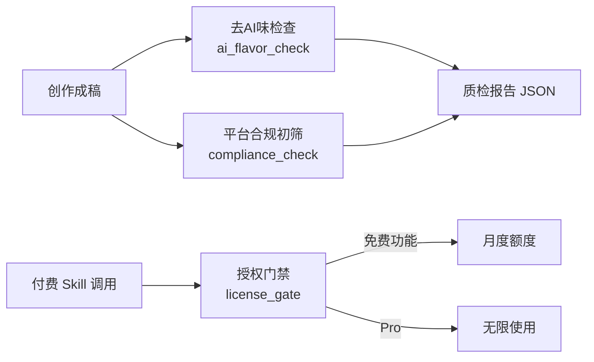

# 自媒体运营工厂 · 开源核心（selfmedia-ops-center）

> 自媒体内容生产的「质检 + 授权」开源基础设施：去 AI 味检查、平台合规初筛、可复现的依赖与安全审计、可商用的 Skill 授权体系。

  

完整版「自媒体运营工厂 Pro Skill 包」（选题雷达、一键全自动生产、数据飞轮、三平台爆款跟踪与 AI 拆解、Agent SOP 自动升级）为付费订阅产品，见文末。

## 架构



## 模块

| 模块 | 说明 |
|---|---|
| [scripts/ai_flavor_check.py](scripts/ai_flavor_check.py) | 去 AI 味机器初筛：二元对比壳、三拍结构、报幕式过渡、对称收束、正文引号/破折号等 22 条规则，输出可解释 JSON 报告（`output_dir` 已相对化，不泄漏本机路径） |
| [scripts/compliance_check.py](scripts/compliance_check.py) | 内容合规初筛：广告法绝对化用语、医疗/金融/教育承诺、站外导流、标题党、AI 生成标识，支持外挂词库 |
| [scripts/security_utils.py](scripts/security_utils.py) | 安全工具：job_id 白名单、SSRF URL 校验（禁内网/元数据地址）、xlsx zip 炸弹防护 |
| [scripts/security/osv_audit.py](scripts/security/osv_audit.py) | 依赖漏洞审计（OSV API 直查） |
| [scripts/license/](scripts/license/) | Ed25519 签名 token 授权体系：发码（token_mint）、安装（install）、运行时门禁（license_gate，含免费额度/设备绑定/到期/tier） |
| [demo/](demo/) | 可运行的样例文章与质检报告 |

## 快速开始

```bash
python3 -m venv .venv && source .venv/bin/activate
pip install -r requirements.lock

# 去 AI 味检查（报告内 output_dir 自动相对化）
python3 scripts/ai_flavor_check.py demo/样例文章/ --out demo/ai_flavor_report.json

# 合规初筛
python3 scripts/compliance_check.py demo/样例文章/

# 授权门禁演示
python3 scripts/license/install.py --show-fingerprint
python3 scripts/license/license_gate.py check --feature production   # 未授权 → 提示升级
```

## 授权体系（用于 Skill 商业化）

- 卖家：`token_mint.py --keygen` 生成密钥对（私钥只在本机）→ `--mint --tier pro --bind <设备指纹>` 签发绑定单设备的签名 token。
- 买家：`install.py --bind-token <token>` 激活；`license_gate.py check --feature <name>` 在每次付费功能前调用。
- 免费额度：`viral_breakdown` 默认 3 次/月（本地计数，随月份重置）；Pro token 无限。
- 密码学细节、判定优先级与安全边界见 [WHITEPAPER.md](WHITEPAPER.md)。

## 安全与隐私

- 本仓库**不包含**任何真实账号数据、发布内容、NAS 配置或第三方 skill；
- 报告/日志中的路径一律相对化；发布前必须通过 [SECURITY_CHECKLIST.md](SECURITY_CHECKLIST.md) 全部检查（含本地绝对路径扫描）；
- CI 五道闸门 + 功能测试：gitleaks / pip-audit / bandit / semgrep / CodeQL / pytest；
- 漏洞报告请走 [SECURITY.md](SECURITY.md) 的流程。

## 文档

- [WHITEPAPER.md](WHITEPAPER.md)：22 条去 AI 味规则的判定逻辑、授权体系设计、安全工具覆盖与 FAQ
- [SECURITY_CHECKLIST.md](SECURITY_CHECKLIST.md)：发布前逐项扫描清单

## 开源协议

[MIT](LICENSE)。第三方 skill（gzh-design / guizang / dbskill / xiaowan-wechat-layout 等）不属于本仓库，使用时请遵守各自 LICENSE。

## Pro Skill 包（付费）

完整运营工厂包含：选题评分双池、一键全自动生产、数据飞轮经验反哺、三平台每日爆款跟踪与 AI 拆解、9 角色 Agent SOP、合规+去 AI 味全套、公众号草稿推送。

- 订阅：月付 ¥29 / 年付 ¥199
- 购买与激活：面包多自动发货（token 绑设备），详情见商品页
