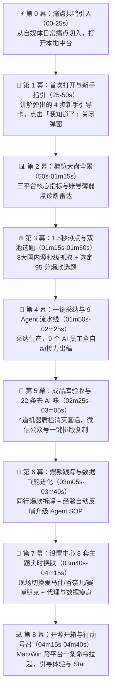

# 《自媒体运营工厂 2.0》用户实操全流程口播稿（含新手引导与关弹窗实操）

- **视频定位**：自媒体创作者真实视角 · 保姆级使用全流程精讲
- **预估总时长**：约 4.0 - 4.5 分钟
- **配音音色**：微软 Azure 神经语音 · 云希（`zh-CN-YunxiNeural`）
- **字幕特效**：**贴底白底黄字特效字幕**（屏幕最底端安全区、超薄圆角白底半透明底框、亮黄金色粗体字、绝不遮挡上方界面）

---

## 🎬 逐幕分镜与口播台词规划表

---

### 【第 0 幕 · 痛点共鸣引入】（00:00 - 00:25 · 约 25 秒）
- **画面动作**：浏览器打开 `http://127.0.0.1:8787`，工作台初始化加载完成。
- **口播台词**：
  > “作为一个每天都要更新的自媒体人，我之前最头疼的就是：找热点翻遍全网找两小时，写完排版又折腾一小时，最后发出去还因为 AI 味太重直接被平台限流。
  > 
  > 后来我用上了这个开源的「自媒体运营工厂 2.0」，直接把我的全套工作流搬到了本地。今天就以我的日常使用视角，手把手带大家看看它是怎么帮我每天 10 分钟搞定多平台生产的。”

---

### 【第 1 幕 · 首次打开与新手指引】（00:25 - 00:50 · 约 25 秒）
- **画面动作**：
  - 页面初次加载，中央自动弹出「🚀 快速开始 · 3 分钟跑通」新手指引弹窗；
  - 鼠标光标依次划过并高亮展示 4 个步骤：1. 配置 AI 引擎 ➔ 2. 看今日选题 ➔ 3. 采纳自动生产 ➔ 4. 查看成品并发布；
  - 鼠标滑到弹窗底部，**点击「我知道了，开始使用」按钮**，弹窗平滑关闭消失，完整呈现底层概览大盘。
- **口播台词**：
  > “首次在浏览器打开工作台，中央会自动弹出一个‘3 分钟新手指引’。
  > 
  > 这里非常清晰地帮新手划出了 4 个核心步骤：先在设置里配好 AI 引擎，接着看今日推荐选题，然后一键采纳自动生产，最后在成品库直接取用发布。
  > 
  > 哪怕是纯小白，跟着这 4 步也能 3 分钟上手。了解之后，我们点击底部的‘我知道了，开始使用’，关闭引导，正式进入工作台。”

---

### 【第 2 幕 · 概览大盘：全景掌控】（00:50 - 01:15 · 约 25 秒）
- **画面动作**：
  - 引导弹窗关闭后，镜头停留在「概览」首页；
  - 鼠标平滑向下滚动，展示公众号、小红书、短视频三端的核心运营数据看板与走势图；
  - 悬停在「账号薄弱点诊断雷达」上。
- **口播台词**：
  > “关掉引导后，我们看到的是工作台首页：概览大盘。
  > 
  > 这里实时聚合了公众号、小红书、短视频三端的核心运营数据与发布节奏。系统还会自动生成‘账号薄弱点诊断雷达’，一眼看出你是选题欠缺热度、排版停留率低，还是完播率不足，数据驱动，不再盲目摸黑发文。”

---

### 【第 3 幕 · 选题雷达：1.5 秒全网捕获】（01:15 - 01:50 · 约 35 秒）
- **画面动作**：
  - 鼠标点击左侧「**选题**」菜单；
  - 点击顶部「**⚡ 采集热点 + 推荐**」按钮；
  - 现场展开微博、B站、百度等 8 大国内源详情列表；
  - 鼠标滚动到下方的「日更池」表格，悬停在第一行 95 分的高分选题上。
- **口播台词**：
  > “每天早上开工第一件事：点击左侧的「选题」模块。
  > 
  > 点一下‘采集热点’，只要 1.5 秒，微博热搜、B站热门、知乎、百度、少数派等 8 大主流热榜就全抓回来了，完全不需要翻墙或配置复杂的爬虫。
  > 
  > 往下看，系统已经用算法帮我们分好了‘日更池’和‘周更池’，每个选题都综合了时效、热度、质量和账号垂直度自动打分。比如今天这条 95 分的 AI 热门选题，爆款潜质最高，我就直接选它了。”

---

### 【第 4 幕 · 采纳生产：9 个 AI 员工全自动流水线】（01:50 - 02:25 · 约 35 秒）
- **画面动作**：
  - 鼠标点击该选题右侧的「**采纳生产**」按钮（触发蓝色波纹）；
  - 切换到左侧「**流水线**」菜单；
  - 镜头展示流水线状态、9 个协同 Agent 节点与实时任务进度条。
- **口播台词**：
  > “选好之后，直接点击‘采纳生产’。
  > 
  > 切换到‘流水线’页面，你可以看到后台已经在全自动运转了：先是资深采编 Agent 帮我们搜集全网事实论据；接着长文主编开始按金字塔结构撰写深度正文；美术总监还会自动给文章插入好看的红白系交互数据图表；最后短视频导演生成 120 秒分镜。
  > 
  > 相当于有 9 个 AI 员工在后台帮你流水线作业，喝口咖啡的功夫，3 分钟全套图文就做好了。”

---

### 【第 5 幕 · 成品验收：22 条去 AI 味机器质检】（02:25 - 03:05 · 约 40 秒）
- **画面动作**：
  - 鼠标点击左侧「**成品库**」菜单；
  - 展开刚生成的文章，鼠标下移展示「去 AI 味 22 条规则检测报告」与「合规审查报告」；
  - 滚动展示右侧排版好的微信公众号红白系文章，点击「**一键复制**」按钮。
- **口播台词**：
  > “内容做完后，我们来到‘成品库’验收。
  > 
  > 很多人担心 AI 写出来的文章一股‘机器味’，但这里内置了 22 条去 AI 味可计算规则，把‘不是…而是…’、‘值得注意的是’这种假大空套话全消解掉了，质检全绿才会放行。
  > 
  > 看看右边排版好的公众号文章，重点文字加粗、数据对比图表全都有。点击‘一键复制’，直接粘贴到微信公众平台后台就能发，一秒都不用手动排版；左边还有小红书高清卡片和短视频脚本，真正做到拿来就能发。”

---

### 【第 6 幕 · 运营复盘：爆款拆解与数据飞轮自进化】（03:05 - 03:40 · 约 35 秒）
- **画面动作**：
  - 点击左侧「**爆款跟踪**」菜单，展示同行万赞爆款列表与 AI 拆解；
  - 紧接着点击「**数据飞轮**」菜单，展示飞轮仪表盘与 Lessons 经验库；
  - 点击「**一键反哺升级**」按钮。
- **口播台词**：
  > “平时想学习同行爆款，点开‘爆款跟踪’，系统会抓取对标账号的万赞内容，AI 一键帮我们拆解它的引流钩子与文案骨架。
  > 
  > 发完内容拿到真实反馈后，来到‘数据飞轮’。每次踩坑的教训和爆款经验都会沉淀在经验库里，点击‘一键反哺’，这些经验就会自动写进 9 个 Agent 的 SOP 里，让整个平台越写越懂你的账号，越用越聪明。”

---

### 【第 7 幕 · 设置中心全功能拆解：个性化与后台配置】（03:40 - 04:30 · 约 50 秒）
- **画面动作**：
  - 鼠标点击左下角或右上角「**⚙ 设置**」打开设置配置中心；
  - 鼠标在左侧菜单栏依次点击并展示各个选项卡：
    1. 点击「**个人资料**」：展示自定义头像与昵称；
    2. 点击「**外观主题**」：**现场连续切换「爱马仕橙」、「香奈儿黑金」、「赛博朋克」**，整个界面背景与光效在镜头前实时流光变色，展示毛玻璃滑块调节；
    3. 点击「**文风设置**」：展示个人文风指南、预设模板与「AI 初始化向导」；
    4. 点击「**AI 引擎**」：展示 DeepSeek / OpenAI API Key 与模型配置；
    5. 点击「**网络与代理**」：展示代理地址填报与「⚡ 测试代理连通性」按钮；
    6. 点击「**公众号**」：展示微信公众平台 AppID 与自动推草稿配置；
    7. 点击「**数据管理**」：展示磁盘占用分析与「一键清理瘦身」；
  - **点击左上角「← 返回」按钮关闭设置弹窗**。
- **口播台词**：
  > “再来看我们的设置中心，左侧提供了完整的配置菜单：
  > 
  > 第一项「个人资料」，支持自定义你的头像与专属昵称；
  > 
  > 第二项「外观主题」，内置了爱马仕橙、香奈儿、赛博朋克等 8 套高定质感主题，点击就能一秒换肤，还能无级调节毛玻璃质感；
  > 
  > 第三项「文风设置」，你可以套用预设模板或使用 AI 向导，定制属于你自己的个人写作风格与专属 SOP；
  > 
  > 接着是「AI 引擎」，填入 DeepSeek 或 OpenAI Key 即可唤醒 AI 生产力；
  > 
  > 如果要抓海外热点，在「网络与代理」填入代理并一键测试；配置好「公众号」还能实现草稿箱直推；
  > 
  > 最后在「数据管理」里，一键清理历史缓存为电脑瘦身。设置完成后点击返回即可。”

---

### 【第 8 幕 · 怎么开始用：免费开源与一键启动】（04:15 - 04:40 · 约 25 秒）
- **画面动作**：
  - 关闭弹窗后回到大盘全景；
  - 画面底部浮现 GitHub 项目地址与终端一条启动命令（`./start.sh`）。
- **口播台词**：
  > “最后说说怎么安装使用：
  > 
  > 这个项目的核心功能完全开源、零依赖，Mac 和 Windows 都能用。在 GitHub 搜索 `selfmedia-ops-center` 下载代码，运行一条启动脚本，浏览器就会自动打开这个工作台，直接就能上手操作。
  > 
  > 想要搭建属于自己的一人自媒体工厂的朋友，赶紧去 GitHub 体验并点个 Star 吧！”
