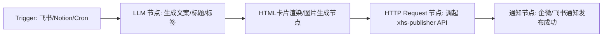

# NAS 端 n8n + 小红书自动化发布部署指南

本目录包含在 NAS（群晖 Synology / 威联通 QNAP / UNRAID / 极空间 / 绿联 / 任意 Linux Docker 环境）部署 **n8n 自动化工作流** 和 **小红书自动发布 Worker** 的完整配置。

---

## 目录结构
```text
nas-n8n/
├── docker-compose.yml       # Docker Compose 核心服务配置文件
├── .env.example             # 环境变量配置模板
├── xhs_worker/              # 小红书 Playwright 自动化发布服务
│   └── main.py              # FastAPI + Playwright 服务端代码
└── shared_files/            # 跨容器共享目录（存放 Cookie、生成的图片等）
```

---

## 部署步骤

### 第一步：准备 NAS 目录与环境文件
1. 将 `nas-n8n` 文件夹上传到 NAS 的 `docker/n8n` 目录下。
2. 复制 `.env.example` 为 `.env`：
   ```bash
   cp .env.example .env
   ```
3. 修改 `.env` 中的 `N8N_HOST` 为你的 NAS 局域网 IP（例如 `192.168.1.100`），并修改 `POSTGRES_PASSWORD` 强密码。

---

## 第二步：一键启动 Docker 服务

### 选项 A：通过 SSH 命令行启动
```bash
cd /volume1/docker/n8n
docker-compose up -d
```

### 选项 B：通过群晖 Container Manager / Portainer
1. 打开群晖 **Container Manager** -> **项目 (Project)** -> **创建**。
2. 填入项目名称 `n8n-automation`，选择路径为上传的 `nas-n8n` 文件夹。
3. 拷贝 `docker-compose.yml` 内容并保存启动。

---

## 第三步：初始化小红书登录 Cookie
小红书发布需要保留个人账号登录状态：
1. 首次使用时，在本地或容器内使用 Playwright 登录一次 `creator.xiaohongshu.com`。
2. 保存生成的 `xhs_cookies.json` 文件并放置在 NAS 的 `shared_files/xhs_cookies.json` 路径下。

---

## 第四步：在 n8n 中配置自动化 Workflow

访问 `http://<NAS_IP>:5678` 注册管理员账号，建立以下 5 步自动化工作流：



### HTTP Request 节点配置（发布至小红书）
- **Method**: `POST`
- **URL**: `http://xhs-publisher:8000/publish`
- **Header**: `Content-Type: application/json`
- **Body**:
  ```json
  {
    "title": "={{ $json.title }}",
    "content": "={{ $json.content }}",
    "images": [
      "/data/shared/slide1.png",
      "/data/shared/slide2.png"
    ],
    "tags": ["AI大模型", "自媒体运营", "高效工具"],
    "cookies_json_path": "/data/shared/xhs_cookies.json"
  }
  ```

---

## 常见问题处理
- **n8n 连不上 PostgreSQL**：等待 10-15 秒，PostgreSQL 容器健康检查通过后 n8n 会自动启动。
- **图片文件传递**：共享目录映射为 `./shared_files` <-> `/data/shared`，可以在 n8n 中通过 Code 节点生成图片并写入此目录。
