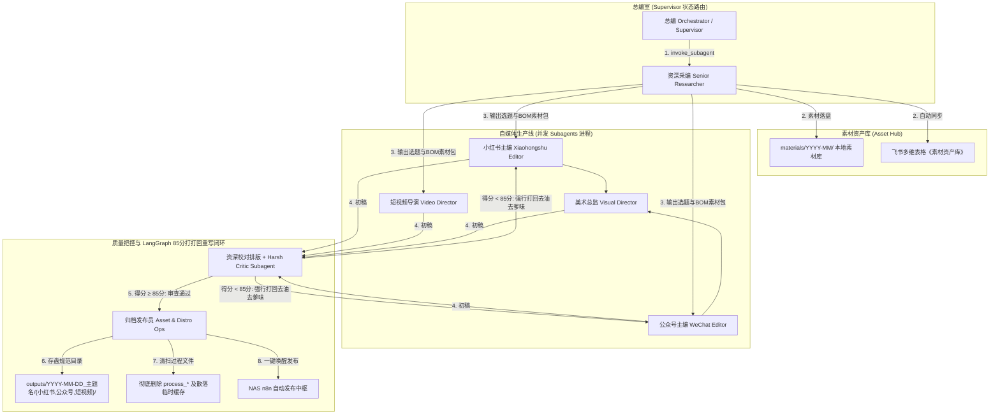

# 自媒体运营工厂 (Teamwork 多智能体协同工作流)

**描述**：基于拟真自媒体报社岗位体系与 Teamwork 多智能体协同的自媒体内容全流程生产与发布中枢（小红书 + 微信公众号双平台 + 短视频脚本）。  
**触发方式**：`/自媒体运营工厂` 或「启动自媒体运营工厂」  
**核心哲学**：个人 IP 为核、岗位专职化、并发高效、审美优先、定稿即清扫。

---

## 🏛️ 报社拟真岗位架构与协同分工 (Teamwork Roles)

本工作流吸取 GitHub 开源项目（LangGraph Supervisor Pattern + CrewAI Role Flows）最强架构，采用 **Antigravity 系统级 Teamwork 混合协同模型**。由总编（Orchestrator）充当 Supervisor 状态路由器，通过底层 `define_subagent` / `invoke_subagent` 唤醒物理 Subagent 进程并执行冷酷质量闭环：



---

## 📋 执行步骤（岗位职责与 Standard Operating Procedure）

### 1. 选题与素材资产收集阶段
* **总编 (Orchestrator)**：
  - 接收用户主题指令（及可选的**种子素材/随手笔记/报错截图**），下发选题规划要求。
  - 使用 `invoke_subagent` 调起 **资深采编 Subagent** 独立进程进行热点与素材挖掘。
* **资深采编 (Senior Researcher & Planner Subagent)**：
  - **热点雷达先行（2026-08-04 起生效）**：先运行 `python3 scripts/fetch_hot_topics.py` 从 NAS RSSHub 拉取多平台热榜，落盘 `materials/YYYY-MM/YYYY-MM-DD_热点雷达.md`；全部源失败时降级用 WebSearch 搜集热点（已知微博/知乎/掘金路由有风控，36氪/少数派/B站稳定）。
  - **选题推荐（2026-08-06 起生效）**：再运行 `python3 scripts/suggest_topics.py` 按 IP 相关度 + 标题冲击力 + 跨源热度排序，产出 3-5 个选题候选（含建议视角与标题公式类型）落盘 `materials/YYYY-MM/YYYY-MM-DD_选题推荐.md`；采编在此基础上研判筛选，📕 封面套路观察须在创作前补充。
  - **优先解析用户投喂的种子素材 (Seed-Feeding SOP)**：将用户的真实经历、语音草稿、报错截图或数据提炼为核心血肉。
  - 收集最新热点、竞品爆款 Hook、BOM 成本/供应链/财务数据。
  - 明确调用 [dbskill](file:///Users/xiaowuliao/Projects/自媒体发布agent/skills/dbskill) 的 `/dbs-benchmark` 进行对标账号拆解，`/dbs-content` 提炼切入点，`/dbs-deconstruct` 解构对标爆款案例。
  - **素材 schema 化（强制契约，2026-08-04 起生效）**：素材包中**每一条素材必须带双标注**，无标注的素材视为无效条目：
    - `source_type`（来源三级标注）：
      - `真实数据` —— 有明确出处的数字/案例（链接、截图、官方报告）；
      - `用户投喂` —— 用户提供的真实经历、草稿、截图；
      - `AI推断` —— AI 推演/估算的内容。**⚠️ `AI推断` 条目严禁在成稿中作为事实引用，只能作为观点启发**（防虚构案例）。
    - `priority`：`核心` / `辅助`。每次素材包必须标记 **3-5 条 `核心` 素材**（最有冲击力的数字/案例/Hook），下游主编**强制 100% 消费**，由 harsh-critic 机器校验。
    - 标注格式：每条素材末尾追加 `（source_type: 真实数据 | priority: 核心）`。
  - **沉淀素材资产库（素材不随任务结束而丢失）**：
    - ① 本地自动落盘至 `materials/YYYY-MM/YYYY-MM-DD_主题素材包.md`。
    - ② 自动调用 n8n 同步推送至飞书多维表格《自媒体素材资产库》，按行业/标签分类沉淀。
  - **产出**：3-5 个爆款选题大纲 + 带 schema 标注的素材包（提交总编与用户确认）。

---

### 2. 专职并发创作阶段 (Parallel Creation)
选题确认后，总编并行调起以下专职 Subagent 独立创作，彻底隔离平台调性。

**📜 成稿契约（强制）**：所有主编的成稿 `文案.md` 必须带 frontmatter（**权威 Schema 见 [contract-schema.md](file:///Users/xiaowuliao/Projects/自媒体发布agent/workflows/contract-schema.md)、成果规格与验收清单见 [产出标准.md](file:///Users/xiaowuliao/Projects/自媒体发布agent/workflows/产出标准.md)**，校验器与本文档均以其为准）：

```yaml
---
job_id: YYYY-MM-DD_主题名
platform: 小红书 | 公众号 | 短视频
consumed_materials: [M1, M3, M4]   # 实际引用的素材包条目编号，核心素材必须全部在内
hook_formula: dbs-xhs-title #26    # 标题/开头使用的公式编号（小红书/公众号必填，可追溯）
---
```

- **核心素材强制消费**：素材包中 `priority: 核心` 的条目必须 100% 出现在成稿中（具体数字/案例不得抽象化），由 harsh-critic 第零步机器校验。
- **数字密度**：小红书正文 ≥2 个具体数字；公众号长文 ≥2 个具体数字 + ≥1 个真实项目/工具名。

* **小红书主编 (Xiaohongshu Chief Editor Agent)**：
  - 加载 [personal-style-guide.md](file:///Users/xiaowuliao/Projects/自媒体发布agent/skills/personal-style-guide.md) 与小红书短平快语调。
  - **必须调用 `/dbs-xhs-title`**（dbskill 子技能）：从 75 个爆款标题公式中匹配 ≥3 种心理触发器类型，每个标题标注公式编号。
  - **产出**：爆款小红书文案（包含强 Hook 标题、痛点正文、引导互动、搜索标签）。
* **公众号主编 (WeChat Longform Chief Editor Agent)**：
  - 加载 [personal-style-guide.md](file:///Users/xiaowuliao/Projects/自媒体发布agent/skills/personal-style-guide.md) 注入极客操盘手洞见。
  - **必须调用 `/dbs-hook`**（dbskill 子技能）诊断开头：话题 + Hook + 可信度三要素。
  - **真实感清单（硬指标）**：≥1 段第一人称经历/观察（来自种子素材；无种子素材时向用户索取，严禁脑补虚构）。
  - **产出**：结构化深度长文，设计好多级标题与金句引用。
* **短视频导演 (Video Director Agent)** *(当需短视频/脚本时选配)*：
  - 加载 [viral-content-skill](file:///Users/xiaowuliao/Projects/自媒体发布agent/skills/viral-content-skill/SKILL.md)。
  - **必须调用 `/dbs-hook`**：0-3s Hook 独立设计（话题+Hook+可信度公式），禁止压缩文章第一句充当。
  - **产出**：120s 黄金分镜脚本（包含 0-3s Hook / 3-15s 切入 / 15-60s 硬核拆解 / 60-90s 避坑反转 / 90-120s 升华金句，附带画面、运镜、台词、花字、音效）。
* **美术总监 (Visual Design Director Agent)**：
  - 调用 [guizang-social-card-skill](file:///Users/xiaowuliao/Projects/自媒体发布agent/skills/guizang-social-card-skill/SKILL.md) 渲染 3:4 结构化 HTML 视觉卡片。
  - 调用 [generate_ai_image.py](file:///Users/xiaowuliao/Projects/自媒体发布agent/scripts/generate_ai_image.py) 生成高冲击力 FLUX / DALL-E 3 艺术封面。
  - **产出**：3:4 视觉卡片 HTML 与最终高清封面图片。

---

### 3. 校对排版与质检阶段 (Quality Assurance)
* **资深校对排版 (Chief Reviewer & Layout Editor Agent)**：
  - 必须优先强制加载 [harsh-critic-skill](file:///Users/xiaowuliao/Projects/自媒体发布agent/skills/harsh-critic-skill/SKILL.md) **v2 双轨评分**：先跑「第零步：素材契约对照检查」（核心素材引用率必须 100%），再算正向质量分 60 + 负向扣分 40，输出逐项评分明细。同一篇连续 2 次 REJECTED 即升级人工仲裁（防循环陷阱）。
  - 运行契约校验脚本做机器兜底：
    ```bash
    python3 scripts/validate_materials_contract.py outputs/YYYY-MM-DD_主题名/
    ```
    核心素材未 100% 引用或 consumed_materials 假报关时，直接 REJECTED。
  - 必须加载 [xiaowan-wechat-layout-skill](file:///Users/xiaowuliao/Projects/自媒体发布agent/skills/xiaowan-wechat-layout-skill/SKILL.md) **（No.1 最高视觉主导规范）**，控制装饰预算、校验移动端首屏与消除断行/孤行。
  - 加载 [gzh-design-skill](file:///Users/xiaowuliao/Projects/自媒体发布agent/skills/gzh-design-skill/SKILL.md) 对公众号版进行美化 HTML 转换（多主题 + 深色模式）。
  - **明确调用 [dbskill](file:///Users/xiaowuliao/Projects/自媒体发布agent/skills/dbskill)**：调用 `/dbs-resonate` 审查文稿共鸣度，调用 `/dbs-spread` 进行传播力诊断与商业逻辑打分。
  - 审查个人 IP 黑白词汇表，进行二次精修打磨。
  - **产出**：harsh-critic 评分报告 + 审核通过的高品质小红书定稿、公众号 HTML 最终版及脚本定稿。

---

### 4. 归档与清扫分发阶段 (Archiving & Cleanup Ops)
* **归档发布员 (Asset & Distribution Ops Agent)**：
  - **严格落盘定稿**：创建目录 `outputs/YYYY-MM-DD_主题名/{小红书,公众号,短视频}/`，将最终定稿存入对应子目录：
    - 📕 小红书: `outputs/YYYY-MM-DD_主题名/小红书/文案.md`, `视觉卡片.html`, `封面.png`
    - 📰 公众号: `outputs/YYYY-MM-DD_主题名/公众号/文案.md`, `排版.html`, `移动端预览.html`
    - 🎬 短视频: `outputs/YYYY-MM-DD_主题名/短视频/120s黄金分镜脚本.md`
  - **强行清扫过程临时文件** *(强制执行)*：
    - 自动清理删除生成过程中产生的 `processed_images*` 临时目录及根目录下的临时文件，保证 `outputs/` 目录极其干净。
  - **发布就绪（草稿箱模式）**：呈现最终 Checklist 与成果文件卡片，等待用户回复“确认发布”后调用 [publish_to_n8n.py](file:///Users/xiaowuliao/Projects/自媒体发布agent/scripts/publish_to_n8n.py) 发送至微信公众号草稿箱和小红书本地素材准备包，由用户在手机端进行最后手动发送外网。

---

## 🗂️ Job 状态机（断点续跑，2026-08-04 起生效）

每个选题对应一个 Job，状态持久化于 `jobs/<job_id>/state.json`，任何环节失败从断点恢复而非重跑全流程。

**8 态流转**：`topic → materials → draft → visual → review → archive → publish → recycle`

| 状态 | 进入条件（产物要求） |
|---|---|
| topic | 选题大纲经用户/总编确认 |
| materials | `materials/YYYY-MM/<job_id>素材包.md`（schema 双标注）落盘 |
| draft | 三平台 `文案.md` 带 frontmatter 契约 |
| visual | 视觉卡片 HTML + 封面 PNG 落盘 |
| review | `validate_materials_contract.py` PASSED + harsh-critic ≥85 |
| archive | 三级目录归档 + process_* 临时文件清扫 |
| publish | `publish_log.json` 发布记录 |
| recycle | 发布 48h 数据回收 |

**操作命令**：
```bash
python3 scripts/job_state.py init <job_id> --theme "主题"
python3 scripts/job_state.py set  <job_id> <state> --score N --note "备注"
python3 scripts/job_state.py reject <job_id> --note "打回原因"   # 连续 2 次自动锁死待人工仲裁
python3 scripts/job_state.py show <job_id> / list
```

**规则**：每完成一个环节必须 `set` 推进状态；跳态会触发产物确认预警；`reject` 自动回退到 draft 并计数。

---

## 🔄 数据闭环 SOP（Phase 3，2026-08-04 起生效）

内容发布不是终点，数据回流才是进化燃料。三个机制均已自动化（定时任务驱动）：

> **一键编排**：以上三个机制与每日定时生产均可由 `scripts/run_daily_pipeline.py` 驱动，定时任务只需调用编排器：
> ```bash
> python3 scripts/run_daily_pipeline.py --topics --auto-select   # 定时生产(8/12/20点)：热点→选题→决策超时自动建 Job
> python3 scripts/run_daily_pipeline.py --qa outputs/<job_id>/   # 质检链：契约校验 + harsh-critic 机器评分
> python3 scripts/run_daily_pipeline.py --recycle                # 48h 回收(21:30)：扫描发布 ≥48h 未回收 Job
> python3 scripts/run_daily_pipeline.py --weekly                 # 周度复盘(周日21点)：质量周报
> ```
> 退出码 0 = 全部完成；1 = 有阻塞项（待人工处理），可被定时任务感知。

### 1. 发布 48h 数据回收（每日 21:30 自动检查）
```bash
# 人工回填手机端数据（真实 > 不可靠的自动抓取）
python3 scripts/collect_post_stats.py <job_id> --platform 小红书 \
    --reads 5200 --likes 260 --collects 80 --comments 15
```
- 落盘 `jobs/<job_id>/publish_log.json`；爆款阈值：**阅读 ≥5000 或 点赞 ≥200**。
- 回收完成推进 Job → `recycle` 状态。

### 2. 爆款反哺范文库（达阈值自动触发）
```bash
python3 scripts/init_hit_anatomy.py <job_id>   # 生成解剖骨架（元数据自动预填）
```
- 资深校对排版完成四节解剖（标题/Hook/结构/可复制规则）→ 存入 `skills/范文库/`。
- 「可复制规则」经用户确认后回写 `personal-style-guide.md`；主编创作前必读同平台最新范文（few-shot 优先）。

### 3. 周度质量复盘（每周日 21:00 自动运行）
```bash
python3 scripts/quality_weekly_report.py   # 聚合评分/打回率/高频失分项/发布效果
```
- 周报落盘 `jobs/weekly_report/`；复盘输出 ≤3 条对应具体环节的改进项。
- 质检环节运行 validator 时必须加 `--out outputs/<job_id>/validate_report.json`，作为周报归因数据源。

---

## 🎯 每日定时运行人机协作决策卡点 (Scheduled Run SOP)

当每天 **08:00 / 12:00 / 20:00** 后台定时触发本工作流时，用户需参与以下 2 个核心决策点：

1. **【决策卡点 1：选题决策】**
   - 采编 Agent 在对话框推荐 3-5 个热点选题。
   - **用户操作**：手动回复选题编号；若 **30 分钟内未回复**，系统自动选择热度最高第 1 个选题继续创作。
2. **【决策卡点 2：草稿箱同步确认】**
   - 全套图文、卡片与排版生成完毕且完成临时文件清扫后，归档发布员呈现预览 Checklist。
   - **用户操作**：回复 `确认发布`，系统将文章同步至 **微信公众号草稿箱** 与 **小红书草稿/素材包**；由用户在手机端点击最终发布外网。

---

## 依赖 Skills 库清单
- [harsh-critic-skill](file:///Users/xiaowuliao/Projects/自媒体发布agent/skills/harsh-critic-skill/SKILL.md) (毒舌 0-100 评分 & 去油去爹味打打回重写闭环)
- [xiaowan-wechat-layout-skill](file:///Users/xiaowuliao/Projects/自媒体发布agent/skills/xiaowan-wechat-layout-skill/SKILL.md) (No.1 最高美学规范 & 移动端审查 SOP)
- [gzh-design-skill](file:///Users/xiaowuliao/Projects/自媒体发布agent/skills/gzh-design-skill/SKILL.md) (公众号 HTML 转换)
- [guizang-social-card-skill](file:///Users/xiaowuliao/Projects/自媒体发布agent/skills/guizang-social-card-skill/SKILL.md) (3:4 社交图文视觉卡片)
- [viral-content-skill](file:///Users/xiaowuliao/Projects/自媒体发布agent/skills/viral-content-skill/SKILL.md) (三大专栏与短视频脚本)
- [personal-style-guide.md](file:///Users/xiaowuliao/Projects/自媒体发布agent/skills/personal-style-guide.md) (小吴聊个人 IP 写作风格)
- [dbskill](file:///Users/xiaowuliao/Projects/自媒体发布agent/skills/dbskill) (内容诊断)
